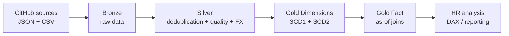
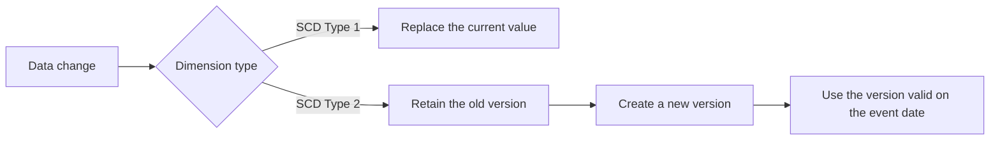
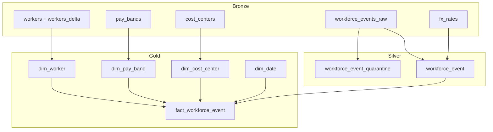

# Fabric Medallion Architecture Lab Guide

<!-- This guide explains the data engineering journey in the Module 2 lab. The lab builds an HR pipeline with PySpark, Delta Lake, and Microsoft Fabric. -->

> **Guiding principle**: start with source files, make them reliable, preserve business history, and then produce a fact table ready for analysis.

In this lab, you progressively build an HR data pipeline in Microsoft Fabric with PySpark and Delta Lake. Each layer has a specific responsibility:

- **Bronze** receives the data as it arrives;
- **Silver** corrects the data and separates records that cannot be used;
- **Gold** organizes the data for business questions and reporting.

The goal is not simply to create tables. At each stage, you verify that the data can reliably move to the next stage.

The journey consists of four notebooks:

1. `nb_01_ingest_bronze.ipynb`
2. `nb_02_create_silver.ipynb`
3. `nb_03_create_gold_dims.ipynb`
4. `nb_03b_create_gold_fact.ipynb`

The execution order is mandatory: each notebook creates tables used by the next one. Always run every cell in a notebook from top to bottom before moving to the next notebook.

## Overview

| Step | Notebook | Main question | Output |
|---|---|---|---|
| 1 | `nb_01_ingest_bronze.ipynb` | How do we land the raw sources? | `bronze.*` tables |
| 2 | `nb_02_create_silver.ipynb` | How do we make the events reliable? | `silver.workforce_event` |
| 3 | `nb_03_create_gold_dims.ipynb` | How do we represent current state and history? | `gold.dim_*` dimensions |
| 4 | `nb_03b_create_gold_fact.ipynb` | How do we link each event to the correct dimensions? | `gold.fact_workforce_event` |



### How to read the pipeline

```text
Inputs         -> main processing                    -> result to verify
raw files      -> ingestion                          -> Bronze tables
Bronze         -> quality + standardization + FX     -> reliable Silver table
Silver         -> dimensions + history               -> Gold dimensions
Silver + Gold  -> as-of key resolution               -> Gold fact table
```

```text
GitHub sources
    |
    v
Bronze: raw data
    |
    v
Silver: clean, conformed data
    |
    v
Gold: historical dimensions and fact table
```

## 1. Prerequisites

> **Before running the first notebook**: create a Lakehouse named `lh_meridian_hr`, attach it to the notebook, verify the Spark session, and run the notebooks in order.

Before you begin:

- open a Fabric notebook;
- attach the `lh_meridian_hr` Lakehouse as the default Lakehouse;
- have an active Spark session;
- have access to the GitHub repository used by the lab;
- run cells in order from top to bottom;
- do not run a Gold notebook before completing Bronze and Silver.

The notebooks use PySpark and Delta Lake. Local Pylance diagnostics concerning `spark`, `pyspark`, or `delta` do not mean that the notebook is incorrect: these objects are provided by the Fabric environment at runtime.

> **Reference point**: the default Lakehouse is where Fabric reads and writes the lab tables. If the wrong Lakehouse is attached, the notebooks may run but create the tables in the wrong location.

### Startup checklist

- [ ] `lh_meridian_hr` attached as the default Lakehouse
- [ ] Spark session started
- [ ] Access to the GitHub repository confirmed
- [ ] No Gold notebook run prematurely
- [ ] Spark UI available for monitoring operations

## 2. Source data

> **Key point**: the lab does not require you to upload files manually. The Bronze notebook downloads them into the Lakehouse.

The data can be viewed in the GitHub repository: [datasets/hr/data at main · modamin/datasets](https://github.com/modamin/datasets/tree/main/hr/data).

However, the notebook uses the following raw URL to download the files:

```text
https://raw.githubusercontent.com/modamin/datasets/main/hr/data
```

The files used are:

```text
feeds/pay_bands_feed.json
feeds/fx_rates.csv
reference/workers.csv
reference/workers_delta.csv
reference/cost_centers.csv
events/workforce_events_YYYY-MM.csv
```

The files are placed in the Lakehouse under:

```text
/lakehouse/default/Files/landing
```

The monthly events cover January 2021 through December 2025.

### File map

| Source | Format | Use |
|---|---|---|
| `pay_bands_feed.json` | Nested JSON | Pay-band history |
| `fx_rates.csv` | CSV | Convert amounts to CAD |
| `workers.csv` | CSV | Initial worker snapshot |
| `workers_delta.csv` | CSV | Changes in the next snapshot |
| `cost_centers.csv` | CSV | Organizational reference data |
| `workforce_events_YYYY-MM.csv` | Monthly CSV | HR events |

## 3. Notebook 1: Bronze ingestion

File: `nb_01_ingest_bronze.ipynb`

| Input | Processing | Output |
|---|---|---|
| GitHub JSON/CSV files | Download, validation, `explode`, metadata enrichment | `bronze.*` Delta tables |

### Objective

Load the source files into the Lakehouse and convert them into raw Delta tables. The Bronze layer keeps the data close to its source format and adds an ingestion timestamp.

Bronze preserves the raw data to retain the original source. The `_source_file` and `_ingested_at` columns identify the source file and ingestion time of each event.

### Steps

1. Enable V-Order to optimize Parquet/Delta storage in Fabric.
2. Create the `bronze` schema if it does not exist.
3. Download the reference data and feeds from GitHub.
4. Verify that an HTTP response is not an HTML error page so an error is not loaded as data.
5. Validate the JSON content of the pay-band feed.
6. Read `pay_bands_feed.json` as multiline JSON.
7. Expand `classifications` and `band_history` with `explode` to produce one row per pay-band version.
8. Load the FX-rate and reference CSV files.
9. Download the monthly event CSV files.
10. Add `_source_file` and `_ingested_at` to the events for traceability.
11. Display the Bronze tables and confirm that all of them exist.

### Tables produced

| Table | Contents |
|---|---|
| `bronze.pay_bands` | Pay-band history by group, level, and effective date |
| `bronze.fx_rates` | Monthly exchange rates to CAD |
| `bronze.workers` | First worker snapshot |
| `bronze.workers_delta` | Second worker snapshot |
| `bronze.cost_centers` | Cost-center reference data |
| `bronze.workforce_events_raw` | Raw HR events, including replayed duplicates |

### Expected checks

- The pay-band JSON is valid.

> **Checkpoint**: do not continue to Silver until all six Bronze tables exist.

## 4. Notebook 2: Silver transformation

File: `nb_02_create_silver.ipynb`

| Input | Processing | Output |
|---|---|---|
| `bronze.workforce_events_raw` + reference data | Deduplication, ISO-3, quality rules, FX conversion | `silver.workforce_event` + quarantine |

### Objective

Clean, deduplicate, and standardize the Bronze events to produce a reliable Silver table.

The primary rule is one final row per `event_id`.

Data never disappears silently: it is either retained in the Silver table or sent to quarantine with an explicit reason.

### Steps

1. Create the `silver` schema.
2. Load the raw events and Bronze reference tables.
3. Deduplicate replayed events: the same event may have been delivered more than once.
4. Keep the row with the most recent `ingest_ts` for each `event_id`.
5. Standardize country codes to ISO-3 so they can be compared reliably.
6. Apply data-quality checks.
7. Write invalid rows to a quarantine table without losing them.
8. Convert local amounts to CAD using the exchange rate for the event month.
9. Write the final Silver table, ready to feed the Gold model.

### Quality rules

| Condition | Quarantine reason |
|---|---|
| `amount_local < 0` | `negative_pay` |
| Worker absent from the worker snapshots | `orphan_employee` |
| Date before January 1, 2021 or in the future | `date_out_of_range` |
| Null or unknown currency | `unresolved_reference` |
| Unresolved work country | `unresolved_reference` |

Null amounts are valid for non-pay events such as leave or deployments.

### Tables produced

| Table | Contents |
|---|---|
| `silver.workforce_event_quarantine` | Rejected rows with the `dq_reason` column |
| `silver.workforce_event` | Clean events with amounts converted to CAD |

### FX conversion

The conversion uses these keys:

```text
rate_month = month of event_date
local_currency = currency in the FX table
```

For a paid event, a missing FX rate raises an explicit error. This prevents a missing rate from being silently replaced with an incorrect value.

### Expected checks

- The row count after deduplication is less than or equal to the Bronze row count.
- Quarantine reasons are displayed by `dq_reason`.
- Clean rows are written to `silver.workforce_event`.
- Paid events have an amount in CAD.

> **Checkpoint**: review `silver.workforce_event_quarantine` before considering Silver clean.

## 5. Notebook 3: Gold dimensions

File: `nb_03_create_gold_dims.ipynb`

| Dimension | Type | What the lab demonstrates |
|---|---|---|
| `dim_date` | Generated | Calendar and time intelligence |
| `dim_cost_center` | SCD Type 1 | Replacing the current state |
| `dim_pay_band` | SCD Type 2 | Effective-date history |
| `dim_worker` | SCD Type 2 | Snapshot history and `row_hash` |

### Objective

Create the dimensions for the Gold analytical model and demonstrate two history-management strategies: SCD Type 1 and SCD Type 2.

An SCD Type 1 dimension retains only the current state, while an SCD Type 2 dimension retains different versions over time.

> **Why does this distinction matter?** In an HR report, you may want to know an employee's current cost center, but also their classification or pay band on the exact date of a past event.



### Calendar dimension: `gold.dim_date`

The table covers January 1, 2021 through December 31, 2025.

It includes:

- `date_key` as a `yyyyMMdd` integer;
- `year`;
- `fiscal_year`, with the fiscal year beginning in April;
- `quarter`;
- `month`;
- `month_name`.

### Cost center: `gold.dim_cost_center`

This dimension uses an SCD Type 1 strategy:

- the current state is replaced;
- no historical version is retained;
- a `cost_center_key` is added;
- `hr_region` is retained for security or RLS filtering requirements.

### Pay bands: `gold.dim_pay_band`

This dimension uses an SCD Type 2 strategy based on the history in the Bronze feed.

For each group and level:

- `effective_from` is the effective date;
- `effective_to` is the day before the next version;
- the latest version receives `9999-12-31` as its end date;
- `is_current` identifies the current version;
- `pay_band_key` identifies each version.

### Workers: `gold.dim_worker`

This dimension uses a periodic snapshot and a close-then-insert mechanism:

1. load the first snapshot;
2. calculate a `row_hash` over the tracked attributes;
3. compare the second `workers_delta` snapshot;
4. close current versions that changed;
5. insert the new versions;
6. insert new workers;
7. assign a `worker_key` to each version.

In other words, when a tracked attribute changes, the old row remains available for historical analysis and a new version becomes the current row.

The tracked attributes are:

```text
classification_group
classification_level
directorate
employment_type
```

### Expected checks

- `gold.dim_date` contains one row per day in the lab period.
- `gold.dim_cost_center` contains one key per cost center.
- `gold.dim_pay_band` contains multiple versions for groups with history.
- `gold.dim_worker` contains current and historical versions.
- Workers modified in `workers_delta` have multiple versions.

> **Checkpoint**: the dimensions must be created before building the fact table.

## 6. Notebook 4: Gold fact table

File: `nb_03b_create_gold_fact.ipynb`

| Input | Processing | Output |
|---|---|---|
| Silver + Gold dimensions | Direct joins and SCD2 range joins | `gold.fact_workforce_event` |

### Objective

Build the final fact table from Silver and the Gold dimensions. Dimension keys are resolved according to the event date.

An *as-of* join links an event not to the current dimension value, but to the version that was valid on the event date.

### Steps

1. Load `silver.workforce_event`.
2. Load `gold.dim_date`, `gold.dim_cost_center`, `gold.dim_worker`, and `gold.dim_pay_band`.
3. Resolve `date_key` using `event_date`.
4. Resolve `cost_center_key` with a direct join.
5. Resolve `worker_key` with an SCD2 range join:

```text
matching employee_id
AND event_date between effective_from and effective_to
```

6. Resolve `pay_band_key` with an SCD2 range join:

```text
matching classification_group
AND matching classification_level
AND event_date between effective_from and effective_to
```

7. Calculate analytical measures from the resolved keys.
8. Write `gold.fact_workforce_event`.
9. Check unresolved keys: a null key indicates a data-quality or reference-data problem.
10. Compare historical pay with the current grid to demonstrate the value of retaining history.

### Calculated columns

- `base_salary_cad`: CAD amount for `Hire`, `Promotion`, and `Step Increment`;
- `bonus_cad`: CAD amount for `Performance Pay`;
- `compa_ratio_at_event`: base salary divided by the band midpoint;
- `below_band_at_event`: indicates whether salary is below the band minimum;
- `band_min_at_event`, `band_mid_at_event`, `band_max_at_event`: boundaries of the band in effect on the event date.

### Final quality check

The final query counts rows where the following keys are null:

- `worker_key`;
- `pay_band_key`;
- `cost_center_key`.

The expected result is zero for each column. If a key is null, investigate:

- a date outside the supported period;
- a worker missing from the dimensions;
- an unknown classification group or level;
- a cost center missing from the reference data.

> **Expected result**: `null_worker = 0`, `null_pay_band = 0`, and `null_cost_center = 0`.

## 7. Final lab result



At the end, the Lakehouse must contain the following tables:

```text
bronze.pay_bands
bronze.fx_rates
bronze.workers
bronze.workers_delta
bronze.cost_centers
bronze.workforce_events_raw

silver.workforce_event_quarantine
silver.workforce_event

gold.dim_date
gold.dim_cost_center
gold.dim_pay_band
gold.dim_worker
gold.fact_workforce_event
```

## 8. Recommended execution order

```text
1. nb_01_ingest_bronze.ipynb
2. nb_02_create_silver.ipynb
3. nb_03_create_gold_dims.ipynb
4. nb_03b_create_gold_fact.ipynb
```

Do not run the Gold notebooks until the required Silver and Bronze tables are available.

## 9. Rerunning the lab

The writes primarily use `overwrite` mode. A new run can therefore replace tables produced by an earlier run.

Before rerunning:

- verify that the default Lakehouse is correct;
- verify the `BASE` URL;
- verify that the GitHub files are accessible;
- verify that the Bronze tables can be recreated;
- rerun all notebooks in order.

## 10. Summary

This lab demonstrates a complete analytical pipeline:

- **Bronze** preserves source data and its ingestion history;
- **Silver** applies quality rules, deduplication, standardization, and currency conversion;
- **Gold** organizes dimensions, preserves business history, and builds a fact table ready for analysis;
- SCD2 joins retrieve the dimension version that was in effect at the time of the event.
