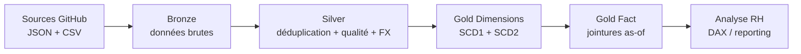
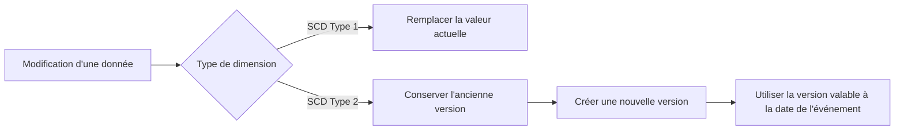
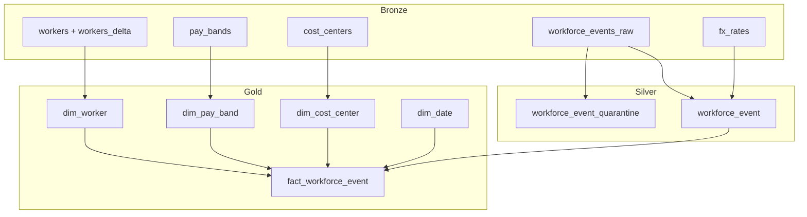

# Guide du lab Architecture Médaillon dans Fabric

<!-- Ce guide explique le parcours de data engineering du lab du module 2. Le lab construit un pipeline RH avec PySpark, Delta Lake et Microsoft Fabric. -->

> **Fil conducteur** : partir de fichiers sources, les rendre fiables, conserver l'historique métier, puis produire une table de faits prête pour l'analyse.

Dans ce lab, vous construisez progressivement un pipeline de données RH dans Microsoft Fabric avec PySpark et Delta Lake. Chaque couche a une responsabilité précise :

- **Bronze** reçoit les données telles qu'elles arrivent ;
- **Silver** corrige et écarte les données non exploitables ;
- **Gold** organise les données pour répondre à des questions métier et faire du reporting.

L'objectif n'est donc pas seulement de créer des tables : à chaque étape, vous vérifiez que les données peuvent passer de manière fiable à l'étape suivante.

Le parcours est composé de quatre notebooks :

1. `nb_01_ingest_bronze.ipynb`
2. `nb_02_create_silver.ipynb`
3. `nb_03_create_gold_dims.ipynb`
4. `nb_03b_create_gold_fact.ipynb`

L'ordre d'exécution est obligatoire : chaque notebook crée les tables utilisées par le suivant. Exécutez toujours toutes les cellules d'un notebook, de haut en bas, avant de passer au suivant.

## Vue d'ensemble

| Étape | Notebook | Question principale | Sortie |
|---|---|---|---|
| 1 | `nb_01_ingest_bronze.ipynb` | Comment déposer les sources brutes ? | Tables `bronze.*` |
| 2 | `nb_02_create_silver.ipynb` | Comment rendre les événements fiables ? | `silver.workforce_event` |
| 3 | `nb_03_create_gold_dims.ipynb` | Comment représenter l'état et l'historique ? | Dimensions `gold.dim_*` |
| 4 | `nb_03b_create_gold_fact.ipynb` | Comment relier chaque événement aux bonnes dimensions ? | `gold.fact_workforce_event` |



### Comment lire le pipeline

```text
Entrées        -> traitement principal              -> résultat à vérifier
fichiers bruts -> ingestion                          -> tables Bronze
Bronze         -> qualité + standardisation + FX    -> table Silver fiable
Silver         -> dimensions + historique           -> dimensions Gold
Silver + Gold  -> résolution des clés as-of          -> table de faits Gold
```

```text
Sources GitHub
    |
    v
Bronze : données brutes
    |
    v
Silver : données nettoyées et conformes
    |
    v
Gold : dimensions historisées et table de faits
```

## 1. Prérequis

> **Avant de lancer le premier notebook** : Creer un Lakehouse sour le nom  `lh_meridian_hr` puis l'attacher au Notebook, vérifier la session Spark et exécuter les notebooks dans l'ordre.

Avant de commencer :

- ouvrir un notebook Fabric ;
- attacher le lakehouse `lh_meridian_hr` comme lakehouse par défaut ;
- disposer d'une session Spark active ;
- avoir accès au dépôt GitHub utilisé par le lab ;
- exécuter les cellules dans l'ordre, de haut en bas ;
- ne pas exécuter un notebook Gold avant d'avoir terminé Bronze et Silver.

Les notebooks utilisent PySpark et Delta Lake. Les diagnostics Pylance locaux concernant `spark`, `pyspark` ou `delta` ne signifient pas que le notebook est incorrect : ces objets sont fournis par l'environnement Fabric au moment de l'exécution.

> **Repère** : le lakehouse par défaut est l'emplacement où Fabric lit et écrit les tables du lab. Si le mauvais lakehouse est attaché, les notebooks peuvent s'exécuter mais produire les tables au mauvais endroit.

### Checklist de démarrage

- [ ] Lakehouse `lh_meridian_hr` attaché par défaut
- [ ] Session Spark démarrée
- [ ] Accès au dépôt GitHub confirmé
- [ ] Aucun notebook Gold lancé prématurément
- [ ] Spark UI disponible pour suivre les opérations

## 2. Données sources

> **À retenir** : le lab ne demande pas de déposer manuellement les fichiers. Le notebook Bronze les télécharge dans le lakehouse.

Les données sont consultables dans le dépôt GitHub : [datasets/hr/data at main · modamin/datasets](https://github.com/modamin/datasets/tree/main/hr/data).

Le notebook utilise cependant l'URL brute suivante pour télécharger les fichiers :

```text
https://raw.githubusercontent.com/modamin/datasets/main/hr/data
```

Les fichiers utilisés sont :

```text
feeds/pay_bands_feed.json
feeds/fx_rates.csv
reference/workers.csv
reference/workers_delta.csv
reference/cost_centers.csv
events/workforce_events_YYYY-MM.csv
```

Les fichiers sont déposés dans le lakehouse sous :

```text
/lakehouse/default/Files/landing
```

Les événements mensuels couvrent la période de janvier 2021 à décembre 2025.

### Carte des fichiers

| Source | Format | Utilisation |
|---|---|---|
| `pay_bands_feed.json` | JSON imbriqué | Historique des fourchettes de rémunération |
| `fx_rates.csv` | CSV | Conversion des montants en CAD |
| `workers.csv` | CSV | Snapshot initial des employés |
| `workers_delta.csv` | CSV | Changements du snapshot suivant |
| `cost_centers.csv` | CSV | Référentiel organisationnel |
| `workforce_events_YYYY-MM.csv` | CSV mensuel | Événements RH |

## 3. Notebook 1 : ingestion Bronze

Fichier : `nb_01_ingest_bronze.ipynb`

| Entrée | Traitement | Sortie |
|---|---|---|
| Fichiers GitHub JSON/CSV | Téléchargement, validation, `explode`, ajout de métadonnées | Tables Delta `bronze.*` |

### Objectif

Charger les fichiers sources dans le lakehouse et les convertir en tables Delta brutes. La couche Bronze conserve les données proches de leur format source, avec un horodatage d'ingestion.

Bronze conserve les données brutes afin de préserver la source d'origine. Les colonnes `_source_file` et `_ingested_at` permettent de retracer le fichier et le moment d'ingestion de chaque événement.

### Étapes

1. Activer V-Order pour optimiser le stockage Parquet/Delta dans Fabric.
2. Créer le schéma `bronze` s'il n'existe pas.
3. Télécharger les référentiels et les flux depuis GitHub.
4. Vérifier qu'une réponse HTTP n'est pas une page HTML d'erreur, afin de ne pas charger une erreur comme si c'était une donnée.
5. Valider le contenu JSON du flux des fourchettes de rémunération.
6. Lire `pay_bands_feed.json` comme JSON multiligne.
7. Déplier `classifications` et `band_history` avec `explode` pour obtenir une ligne par version de fourchette.
8. Charger les CSV de taux FX et de référentiels.
9. Télécharger les CSV mensuels d'événements.
10. Ajouter `_source_file` et `_ingested_at` aux événements pour assurer leur traçabilité.
11. Afficher les tables Bronze créées et confirmer qu'elles sont toutes présentes.

### Tables produites

| Table | Contenu |
|---|---|
| `bronze.pay_bands` | Historique des fourchettes de rémunération par groupe, niveau et date d'effet |
| `bronze.fx_rates` | Taux de change mensuels vers le CAD |
| `bronze.workers` | Premier snapshot des employés |
| `bronze.workers_delta` | Deuxième snapshot des employés |
| `bronze.cost_centers` | Référentiel des centres de coûts |
| `bronze.workforce_events_raw` | Événements RH bruts, y compris les doublons rejoués |

### Vérifications attendues

- Le JSON des fourchettes de rémunération est valide.

> **Point de passage** : ne continuer vers Silver que lorsque les six tables Bronze sont présentes.

## 4. Notebook 2 : transformation Silver

Fichier : `nb_02_create_silver.ipynb`

| Entrée | Traitement | Sortie |
|---|---|---|
| `bronze.workforce_events_raw` + référentiels | Déduplication, ISO-3, règles de qualité, conversion FX | `silver.workforce_event` + quarantaine |

### Objectif

Nettoyer, dédupliquer et standardiser les événements Bronze afin de produire une table Silver fiable.

La règle principale est : une ligne finale par `event_id`.

Une donnée ne disparaît pas silencieusement : elle est soit conservée dans la table Silver, soit dirigée vers la quarantaine avec un motif explicite.

### Étapes

1. Créer le schéma `silver`.
2. Charger les événements bruts et les référentiels Bronze.
3. Dédupliquer les événements rejoués : un même événement peut avoir été livré plusieurs fois.
4. Conserver la ligne ayant le `ingest_ts` le plus récent pour chaque `event_id`.
5. Standardiser les codes pays au format ISO-3 pour pouvoir les comparer de façon fiable.
6. Contrôler la qualité des données.
7. Écrire les lignes invalides dans une table de quarantaine, sans les perdre.
8. Convertir les montants locaux en CAD à l'aide du taux du mois de l'événement.
9. Écrire la table Silver finale, prête à alimenter le modèle Gold.

### Règles de qualité

| Condition | Motif de quarantaine |
|---|---|
| `amount_local < 0` | `negative_pay` |
| Employé absent des snapshots workers | `orphan_employee` |
| Date antérieure au 1er janvier 2021 ou future | `date_out_of_range` |
| Devise nulle ou inconnue | `unresolved_reference` |
| Pays de travail non résolu | `unresolved_reference` |

Les montants nuls sont valides pour les événements qui ne correspondent pas à une paie, par exemple les congés ou les déploiements.

### Tables produites

| Table | Contenu |
|---|---|
| `silver.workforce_event_quarantine` | Lignes rejetées avec la colonne `dq_reason` |
| `silver.workforce_event` | Événements propres et montants convertis en CAD |

### Conversion FX

La conversion utilise les clés suivantes :

```text
rate_month = mois de event_date
local_currency = currency de la table FX
```

Pour un événement rémunéré, un taux FX manquant déclenche une erreur explicite. Cela évite de remplacer silencieusement un taux absent par une valeur incorrecte.

### Vérifications attendues

- Le nombre de lignes après déduplication est inférieur ou égal au nombre de lignes Bronze.
- Les motifs de quarantaine sont affichés par `dq_reason`.
- Les lignes propres sont écrites dans `silver.workforce_event`.
- Les événements rémunérés possèdent un montant CAD.

> **Point de passage** : examiner `silver.workforce_event_quarantine` avant de considérer Silver comme propre.

## 5. Notebook 3 : dimensions Gold

Fichier : `nb_03_create_gold_dims.ipynb`

| Dimension | Type | Ce que le lab démontre |
|---|---|---|
| `dim_date` | Générée | Calendrier et intelligence temporelle |
| `dim_cost_center` | SCD Type 1 | Remplacement de l'état courant |
| `dim_pay_band` | SCD Type 2 | Historique par date d'effet |
| `dim_worker` | SCD Type 2 | Historique par snapshots et `row_hash` |

### Objectif

Créer les dimensions du modèle analytique Gold et montrer deux stratégies de gestion de l'historique : SCD Type 1 et SCD Type 2.

Une dimension SCD Type 1 conserve uniquement l'état actuel, tandis qu'une dimension SCD Type 2 conserve les différentes versions dans le temps.

> **Pourquoi cette distinction est importante ?** Dans un rapport RH, on peut vouloir connaître le centre de coûts actuel d'un employé, mais aussi sa classification ou sa fourchette de rémunération à la date exacte d'un événement passé.



### Dimension calendrier : `gold.dim_date`

La table couvre les dates du 1er janvier 2021 au 31 décembre 2025.

Elle contient notamment :

- `date_key` au format entier `yyyyMMdd` ;
- `year` ;
- `fiscal_year`, avec une année fiscale commençant en avril ;
- `quarter` ;
- `month` ;
- `month_name`.

### Centre de coûts : `gold.dim_cost_center`

Cette dimension utilise une stratégie SCD Type 1 :

- l'état actuel est remplacé ;
- aucune version historique n'est conservée ;
- une clé `cost_center_key` est ajoutée ;
- `hr_region` est conservée pour les besoins de sécurité ou de filtrage RLS.

### Fourchettes de rémunération : `gold.dim_pay_band`

Cette dimension utilise une stratégie SCD Type 2 à partir de l'historique du flux Bronze.

Pour chaque groupe et niveau :

- `effective_from` correspond à la date d'effet ;
- `effective_to` correspond à la veille de la version suivante ;
- la dernière version reçoit `9999-12-31` comme date de fin ;
- `is_current` indique la version actuelle ;
- `pay_band_key` identifie chaque version.

### Employés : `gold.dim_worker`

Cette dimension utilise un snapshot périodique et un mécanisme close-then-insert :

1. charger le premier snapshot ;
2. calculer un `row_hash` sur les attributs suivis ;
3. comparer le deuxième snapshot `workers_delta` ;
4. fermer les versions courantes qui ont changé ;
5. insérer les nouvelles versions ;
6. insérer les nouveaux employés ;
7. attribuer un `worker_key` à chaque version.

Autrement dit, lorsqu'un attribut suivi change, l'ancienne ligne reste disponible pour les analyses historiques et une nouvelle version devient la ligne courante.

Les attributs suivis sont :

```text
classification_group
classification_level
directorate
employment_type
```

### Vérifications attendues

- `gold.dim_date` contient une ligne par jour de la période du lab.
- `gold.dim_cost_center` contient une clé par centre de coûts.
- `gold.dim_pay_band` contient plusieurs versions pour les groupes historisés.
- `gold.dim_worker` contient des versions courantes et historiques.
- Les employés modifiés dans `workers_delta` possèdent plusieurs versions.

> **Point de passage** : les dimensions doivent être créées avant de construire la table de faits.

## 6. Notebook 4 : table de faits Gold

Fichier : `nb_03b_create_gold_fact.ipynb`

| Entrée | Traitement | Sortie |
|---|---|---|
| Silver + dimensions Gold | Jointures directes et jointures de plage SCD2 | `gold.fact_workforce_event` |

### Objectif

Construire la table de faits finale à partir de Silver et des dimensions Gold. Les clés de dimension sont résolues selon la date de l'événement.

Une jointure *as-of* relie un événement non pas à la valeur actuelle d'une dimension, mais à la version qui était valable à la date de l'événement.

### Étapes

1. Charger `silver.workforce_event`.
2. Charger `gold.dim_date`, `gold.dim_cost_center`, `gold.dim_worker` et `gold.dim_pay_band`.
3. Résoudre `date_key` avec `event_date`.
4. Résoudre `cost_center_key` par jointure directe.
5. Résoudre `worker_key` avec une jointure de plage SCD2 :

```text
employee_id identique
ET event_date entre effective_from et effective_to
```

6. Résoudre `pay_band_key` avec une jointure de plage SCD2 :

```text
classification_group identique
ET classification_level identique
ET event_date entre effective_from et effective_to
```

7. Calculer les mesures d'analyse à partir des clés ainsi résolues.
8. Écrire `gold.fact_workforce_event`.
9. Contrôler les clés non résolues : une clé nulle révèle un problème de qualité ou de référentiel.
10. Comparer les rémunérations historiques avec la grille actuelle pour constater l'intérêt de l'historisation.

### Colonnes calculées

- `base_salary_cad` : montant CAD pour `Hire`, `Promotion` et `Step Increment` ;
- `bonus_cad` : montant CAD pour `Performance Pay` ;
- `compa_ratio_at_event` : salaire de base divisé par le milieu de la tranche ;
- `below_band_at_event` : indique si le salaire est inférieur au minimum de la tranche ;
- `band_min_at_event`, `band_mid_at_event`, `band_max_at_event` : bornes de la tranche en vigueur à la date de l'événement.

### Contrôle de qualité final

La requête finale compte les lignes dont les clés suivantes sont nulles :

- `worker_key` ;
- `pay_band_key` ;
- `cost_center_key`.

Le résultat attendu est zéro pour chacune de ces colonnes. Si une clé est nulle, il faut rechercher :

- une date hors période ;
- un employé absent des dimensions ;
- un groupe ou niveau de classification inconnu ;
- un centre de coûts absent du référentiel.

> **Résultat attendu** : `null_worker = 0`, `null_pay_band = 0` et `null_cost_center = 0`.

## 7. Résultat final du lab



À la fin, le lakehouse doit contenir les tables suivantes :

```text
bronze.pay_bands
bronze.fx_rates
bronze.workers
bronze.workers_delta
bronze.cost_centers
bronze.workforce_events_raw

silver.workforce_event_quarantine
silver.workforce_event

gold.dim_date
gold.dim_cost_center
gold.dim_pay_band
gold.dim_worker
gold.fact_workforce_event
```

## 8. Ordre d'exécution recommandé

```text
1. nb_01_ingest_bronze.ipynb
2. nb_02_create_silver.ipynb
3. nb_03_create_gold_dims.ipynb
4. nb_03b_create_gold_fact.ipynb
```

Ne pas lancer les notebooks Gold tant que les tables Silver et Bronze nécessaires ne sont pas disponibles.

## 9. Relancer le lab

Les écritures utilisent principalement le mode `overwrite`. Une nouvelle exécution peut donc remplacer les tables produites précédemment.

Avant de relancer :

- vérifier que le lakehouse par défaut est correct ;
- vérifier l'URL `BASE` ;
- vérifier que les fichiers GitHub sont accessibles ;
- vérifier que les tables Bronze peuvent être recréées ;
- relancer les notebooks dans l'ordre complet.

## 10. En synthèse

Ce lab montre un pipeline analytique complet :

- **Bronze** conserve les données sources et leur historique d'ingestion ;
- **Silver** applique la qualité, la déduplication, la standardisation et la conversion monétaire ;
- **Gold** organise les dimensions, conserve l'historique métier et construit une table de faits prête pour l'analyse ;
- les jointures SCD2 permettent de retrouver la version d'une dimension qui était en vigueur au moment de l'événement.
