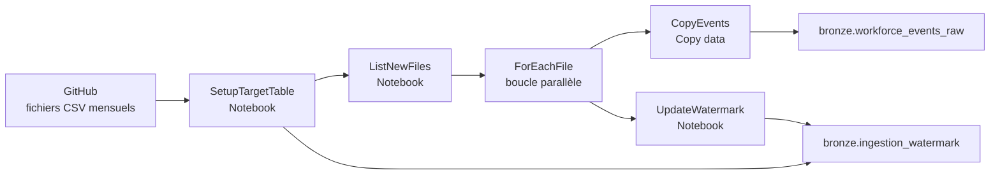
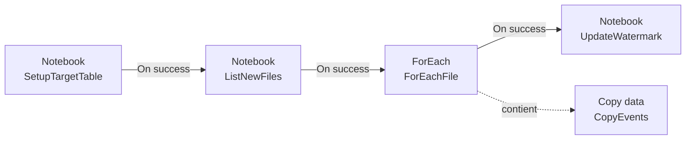

# Guide du lab Ingestion Bronze incrémentielle dans Fabric

<!-- Ce guide explique le parcours d'ingestion incrémentielle du module 3 avec Microsoft Fabric, les notebooks et un pipeline de données. -->

> **Fil conducteur** : découvrir les nouveaux fichiers publiés, les copier en parallèle dans une table Delta Bronze, puis mémoriser le dernier mois traité avec un watermark.

Dans ce lab, vous construisez un pipeline d'ingestion incrémentielle pour les événements RH mensuels. Le pipeline combine trois notebooks et plusieurs activités Fabric :

- un notebook prépare la table cible et initialise le watermark ;
- un notebook découvre les fichiers nouveaux dans GitHub ;
- une activité **ForEach** copie les fichiers en parallèle ;
- un notebook avance le watermark uniquement lorsque le lot est terminé.

L'objectif n'est pas seulement de charger les données. Vous allez aussi vérifier qu'une exécution répétée ne recopie pas les mêmes fichiers et qu'un échec de copie ne fait pas avancer le watermark.

## Vue d'ensemble



| Étape | Composant | Rôle | Résultat |
|---|---|---|---|
| 1 | `nb_setup_lakehouse.ipynb` | Préparer la table cible et le watermark | Table Bronze prête et watermark courant |
| 2 | `nb_list_event_files.ipynb` | Lister les fichiers dont le mois est plus récent | Tableau `files` et nouveau watermark |
| 3 | `ForEachFile` + `CopyEvents` | Copier chaque fichier dans Delta | Lignes ajoutées à `bronze.workforce_events_raw` |
| 4 | `nb_update_watermark.ipynb` | Enregistrer le watermark du lot terminé | `bronze.ingestion_watermark` mis à jour |

## 1. Prérequis

> **Avant de lancer le lab** : créez ou utilisez un lakehouse nommé `lh_meridian_hr`, puis attachez-le comme lakehouse par défaut aux trois notebooks.

Avant de commencer :

- ouvrir un espace de travail Fabric disposant des droits de création de notebooks et de pipelines ;
- disposer d'un lakehouse nommé `lh_meridian_hr` ;
- attacher `lh_meridian_hr` comme lakehouse par défaut dans chaque notebook ;
- avoir accès au dépôt GitHub utilisé par le lab ;
- utiliser un espace de travail de labo pour créer le pipeline ;
- ne pas exécuter les notebooks comme une chaîne indépendante avant d'avoir configuré le pipeline.

Les notebooks utilisent Python, Spark, Delta Lake, `requests` et `notebookutils`. Les diagnostics Pylance locaux concernant `spark`, `notebookutils` ou les bibliothèques Fabric ne signifient pas que les notebooks sont incorrects : ces objets sont fournis par l'environnement Fabric lors de l'exécution.

### Checklist de démarrage

- [ ] Lakehouse `lh_meridian_hr` attaché par défaut aux trois notebooks
- [ ] Accès au dépôt GitHub confirmé
- [ ] Aucun ancien pipeline de test en cours d'exécution
- [ ] Table `workforce_events_raw` supprimée si elle existe déjà
- [ ] Les trois notebooks sont importés dans l'espace de travail

## 2. Données sources

Les fichiers d'événements sont publiés dans le dépôt GitHub suivant :

```text
https://github.com/modamin/fabric-developer-training/tree/main/data/events
```

Le pipeline télécharge les fichiers depuis l'URL de base suivante :

```text
https://raw.githubusercontent.com/modamin/fabric-developer-training/main/data/
```

Les fichiers suivent le modèle :

```text
workforce_events_YYYY-MM.csv
```

Le notebook `nb_list_event_files` utilise l'API GitHub Contents pour découvrir les fichiers disponibles. Il renvoie ensuite des chemins relatifs tels que :

```text
events/workforce_events_2025-10.csv
```

Le tableau complet des événements est chargé dans la table Delta :

```text
bronze.workforce_events_raw
```

## 3. Notebook 1 : préparer la cible et le watermark

Fichier : `nb_setup_lakehouse.ipynb`

### Objectif

Préparer les objets partagés avant toute copie parallèle :

1. créer le schéma `bronze` s'il n'existe pas ;
2. précréer la table Delta `bronze.workforce_events_raw` ;
3. créer la table de contrôle `bronze.ingestion_watermark` ;
4. initialiser le watermark à `2020-12-01 00:00:00` lors de la première exécution ;
5. renvoyer le watermark courant au pipeline.

La table cible doit être créée avant les activités Copy parallèles. Cela évite que plusieurs copies tentent de créer la même table en même temps.

### Paramètres

Marquez la cellule 2 comme cellule de paramètres :

```python
pipeline_name = "workforce_events"
default_watermark = "2020-12-01 00:00:00"
```

### Tables produites

| Table | Rôle |
|---|---|
| `bronze.workforce_events_raw` | Table Delta cible des événements bruts |
| `bronze.ingestion_watermark` | Table de contrôle contenant le dernier mois traité |

### Contrat de sortie

Le notebook renvoie une valeur de sortie que l'activité suivante peut consommer :

```json
{
  "pipeline_name": "workforce_events",
  "watermark": "2020-12-01 00:00:00"
}
```

## 4. Notebook 2 : découvrir les nouveaux fichiers

Fichier : `nb_list_event_files.ipynb`

### Objectif

Recevoir le watermark de l'étape précédente et rechercher les fichiers dont le mois est plus récent. Ce notebook ne lit pas la table de contrôle : il utilise le watermark qui lui est transmis par le pipeline.

Le notebook :

1. appelle l'API GitHub Contents ;
2. conserve uniquement les fichiers correspondant à `workforce_events_YYYY-MM.csv` ;
3. compare le mois du fichier au watermark ;
4. trie les fichiers par mois ;
5. limite le lot à 60 fichiers ;
6. renvoie les chemins Copy et le nouveau watermark.

### Paramètres

```python
watermark = "2020-12-01 00:00:00"
github_owner = "modamin"
github_repo = "fabric-developer-training"
github_branch = "main"
github_path = "data/events"
copy_base_prefix = "events/"
max_files_per_run = 60
```

### Contrat de sortie

```json
{
  "files": [
    "events/workforce_events_2021-01.csv",
    "..."
  ],
  "watermark": "2025-12-01 00:00:00",
  "count": 60
}
```

| Propriété | Utilisation |
|---|---|
| `files` | Tableau fourni à l'activité **ForEach** |
| `watermark` | Valeur à enregistrer après la réussite du lot |
| `count` | Nombre de fichiers sélectionnés |

Lorsque le pipeline est déjà à jour, `files` est vide, `count` vaut `0` et le watermark reste inchangé.

## 5. Notebook 3 : mettre à jour le watermark

Fichier : `nb_update_watermark.ipynb`

### Objectif

Enregistrer le watermark renvoyé par le notebook de découverte après la fin de toutes les copies.

Le notebook :

1. valide `pipeline_name` ;
2. valide que `watermark_timestamp` correspond au premier jour d'un mois ;
3. met à jour la ligne correspondante dans `bronze.ingestion_watermark` ;
4. crée la ligne si le notebook est exécuté seul et qu'elle n'existe pas ;
5. affiche le contenu actuel de la table de contrôle.

### Paramètres

```python
pipeline_name = "workforce_events"
watermark_timestamp = "2020-12-01 00:00:00"
```

Le pipeline remplacera `watermark_timestamp` avec la valeur renvoyée par `ListNewFiles`.

## 6. Construire le pipeline de données

### 6.1 Importer les notebooks

Importez les trois notebooks dans votre espace de travail et attachez `lh_meridian_hr` comme **lakehouse par défaut pour chacun** :

- `nb_setup_lakehouse.ipynb` ;
- `nb_list_event_files.ipynb` ;
- `nb_update_watermark.ipynb`.

Supprimez ou déposez la table `workforce_events_raw` du lakehouse `lh_meridian_hr` si elle existe déjà.

Dans chaque notebook, marquez la cellule 2 comme **cellule de paramètres** afin que le pipeline puisse remplacer les valeurs.

### 6.2 Créer le pipeline

Dans votre espace de travail de labo :

1. sélectionnez **+ New item → Data pipeline** ;
2. nommez le pipeline `pl_ingest_events` ;
3. ajoutez une activité **Notebook** nommée `SetupTargetTable` ;
4. sélectionnez `nb_setup_lakehouse` ;
5. ajoutez une activité **Notebook** nommée `ListNewFiles` ;
6. ajoutez une dépendance **On success** entre `SetupTargetTable` et `ListNewFiles`.

### 6.3 Configurer `ListNewFiles`

Dans **Base parameters**, affectez au paramètre `watermark` la sortie de `SetupTargetTable` :

```text
@json(activity('SetupTargetTable').output.result.exitValue).watermark
```

### 6.4 Ajouter la boucle `ForEachFile`

Ajoutez une activité **ForEach** nommée `ForEachFile` après `ListNewFiles`.

Dans **Settings**, définissez **Items** avec le tableau `files` de la sortie du notebook :

```text
@json(activity('ListNewFiles').output.result.exitValue).files
```

Laissez **Sequential** décoché. Les fichiers peuvent être copiés en parallèle, car `SetupTargetTable` a déjà créé la table cible.

### 6.5 Ajouter l'activité `CopyEvents`

À l'intérieur de `ForEachFile`, ajoutez **Copy data** et nommez l'activité `CopyEvents`.

#### Source

Créez une connexion HTTP avec l'authentification **Anonymous** et utilisez l'URL suivante :

```text
https://raw.githubusercontent.com/modamin/fabric-developer-training/main/data/
```

L'URL doit se terminer par `/`.

Dans l'activité Copy :

- définissez l'URL relative avec l'élément courant ;
- utilisez `@item()` ;
- sélectionnez le format `Delimited Text`.

```text
@item()
```

#### Destination

Sélectionnez le lakehouse `lh_meridian_hr`, puis :

1. choisissez **Tables** ;
2. cochez **Enter manually** ;
3. saisissez `bronze` comme schéma ;
4. saisissez `workforce_events_raw` comme nom de table ;
5. définissez l'action de table sur **Append**.

La destination est donc :

```text
bronze.workforce_events_raw
```

### 6.6 Ajouter `UpdateWatermark`

Ajoutez une activité **Notebook** nommée `UpdateWatermark` après `ForEachFile` avec une dépendance **On success**.

Sélectionnez `nb_update_watermark`, puis configurez les paramètres :

```text
pipeline_name = workforce_events
watermark_timestamp = @json(activity('ListNewFiles').output.result.exitValue).watermark
```

L'expression complète pour `watermark_timestamp` est :

```text
@json(activity('ListNewFiles').output.result.exitValue).watermark
```

## 7. Résultat attendu du pipeline

Le pipeline final doit présenter cette organisation :



Vérifiez les points suivants :

- `SetupTargetTable` est la première activité ;
- `ListNewFiles` reçoit le watermark de `SetupTargetTable` ;
- `ForEachFile` utilise la propriété `.files` ;
- `CopyEvents` se trouve à l'intérieur de `ForEachFile` ;
- `CopyEvents` ajoute les données à `bronze.workforce_events_raw` ;
- `UpdateWatermark` s'exécute uniquement après la réussite de `ForEachFile`.

## 8. Exécuter et vérifier le lab

Le lab utilise trois exécutions pour montrer le comportement incrémentiel.

> **Réservé à l'instructeur :** avant la session, les fichiers `2025-10`, `2025-11` et `2025-12` sont mis de côté dans le dépôt GitHub. Voir [instructor.md](instructor.md).

### Exécution 1 : chargement initial

1. Exécutez le pipeline.
2. `SetupTargetTable` initialise le watermark à `2020-12-01 00:00:00`.
3. `ListNewFiles` renvoie tous les fichiers publiés jusqu'à `2025-09`.
4. `ForEachFile` exécute une activité Copy pour chaque fichier.
5. `UpdateWatermark` enregistre :

```text
2025-09-01 00:00:00
```

Vérifiez la valeur avec une requête sur :

```text
bronze.ingestion_watermark
```

> **Réservé à l'instructeur :** restaurez les trois fichiers mis de côté avant l'exécution 2.

### Exécution 2 : chargement incrémentiel

Après la restauration des fichiers par l'instructeur :

1. exécutez de nouveau le pipeline ;
2. `ListNewFiles` renvoie uniquement les fichiers `2025-10`, `2025-11` et `2025-12` ;
3. `ForEachFile` exécute exactement trois activités Copy ;
4. `UpdateWatermark` avance le watermark à :

```text
2025-12-01 00:00:00
```

### Exécution 3 : aucun nouveau fichier

Exécutez le pipeline une troisième fois :

- `ListNewFiles` renvoie `files = []` ;
- `ForEachFile` ne contient aucun élément à traiter ;
- aucune activité Copy n'est exécutée ;
- le watermark reste à `2025-12-01 00:00:00`.

### Vérification de la table finale

Ouvrez **Tables → bronze → workforce_events_raw** et vérifiez que la table contient environ :

```text
124 485 lignes
```

## 9. Comprendre la reprise après échec

Le watermark n'est avancé qu'après la réussite complète de `ForEachFile`.

Si une activité Copy échoue :

- `UpdateWatermark` ne s'exécute pas ;
- le watermark conserve sa valeur précédente ;
- le lot peut être relancé depuis le même point ;
- les fichiers non confirmés restent donc éligibles lors de la prochaine découverte.

Cette séquence évite de déclarer comme traités des fichiers qui n'ont pas été correctement écrits dans la table Bronze.

## 10. Résultat final du lab

À la fin du lab, le lakehouse doit contenir au minimum les tables suivantes :

```text
bronze.workforce_events_raw
bronze.ingestion_watermark
```

Le pipeline doit respecter le flux suivant :

```text
GitHub
  -> ListNewFiles
  -> ForEachFile / CopyEvents
  -> bronze.workforce_events_raw
  -> UpdateWatermark
  -> bronze.ingestion_watermark
```

Le résultat important est la cohérence entre les données chargées et le watermark : le watermark ne doit jamais dépasser le dernier lot effectivement copié.

## 11. Dépannage rapide

| Symptôme | Vérification |
|---|---|
| Le notebook ne trouve aucun fichier | Vérifier `github_owner`, `github_repo`, `github_branch` et `github_path`. |
| Le pipeline ne peut pas lire la sortie du notebook | Vérifier l'expression `@json(...exitValue).watermark` et le nom exact de l'activité. |
| `ForEachFile` ne lance aucune Copy | Vérifier l'expression `.files` et la sortie de `ListNewFiles`. |
| La destination n'est pas disponible | Vérifier que `lh_meridian_hr` est attaché et que `Enter manually` est sélectionné. |
| La table existe avec une mauvaise structure | Supprimer `workforce_events_raw`, puis relancer `SetupTargetTable`. |
| Le watermark avance trop tôt | Vérifier que `UpdateWatermark` dépend de `ForEachFile` avec **On success**. |
| Les trois fichiers incrémentiels ne sont pas détectés | Vérifier qu'ils ont été restaurés et poussés sur GitHub `main`, pas uniquement déplacés localement. |

## 12. En synthèse

Ce lab montre une ingestion Bronze incrémentielle complète :

- `SetupTargetTable` prépare la table Delta et initialise l'état ;
- `ListNewFiles` transforme le watermark en liste de fichiers à traiter ;
- `ForEachFile` exécute les copies en parallèle ;
- `UpdateWatermark` confirme le lot uniquement après sa réussite ;
- une exécution sans nouveaux fichiers devient une opération sans effet.
