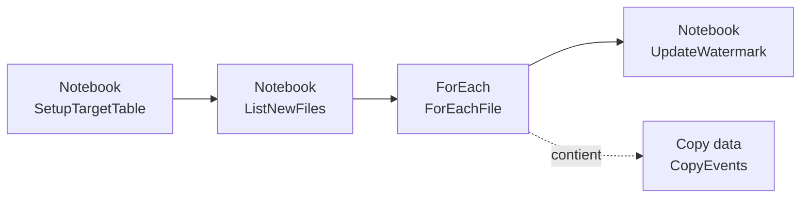

# Module 1 — Ingestion Bronze

**Objectif :** déposer les données sources brutes dans le schéma `bronze` exactement telles qu'elles arrivent, sans nettoyage. Deux styles d'ingestion, chacun choisi pour son cas d'usage :

- **Pipeline de données** → les 60 extractions mensuelles plates d'événements de main-d'œuvre. Copie par lots répétable avec une boucle basée sur le décalage de mois.
- **Notebook** → le flux JSON imbriqué de la grille salariale, le taux de change et les tables de référence. Une activité Copy de pipeline a du mal à aplatir les tableaux imbriqués; un notebook le fait en quelques lignes.

---

Les fichiers d'événements sont nommés `workforce_events_YYYY-MM.csv`. Le notebook de configuration gère l'état du watermark : il crée la table de contrôle, l'initialise lors de la première exécution et renvoie le watermark actuel. Le notebook de découverte reçoit ensuite ce watermark comme paramètre d'entrée, répertorie les fichiers sources sur GitHub et renvoie le tableau des nouveaux fichiers à copier. Le pipeline parcourt simplement ce tableau avec une activité Copy standard, puis avance le watermark après la réussite de chaque Copy. Aucun calcul de date dans le pipeline.

## 1. Créer le pipeline

1. Importez ces notebooks dans l'espace de travail et associez `lh_meridian_hr` comme **lakehouse par défaut pour chacun** :
   - `notebooks/nb_setup_lakehouse.ipynb` — précrée la table cible, crée et initialise le watermark, puis renvoie le watermark actuel.
   - `notebooks/nb_list_event_files.ipynb` — reçoit le watermark en entrée, répertorie les fichiers GitHub et renvoie les nouveaux fichiers.
   - `notebooks/nb_update_watermark.ipynb` — avance le watermark.
2. Supprimez ou déposez la table `workforce_events_raw` du lakehouse `lh_meridian_hr` si elle y existe déjà.
3. Dans les trois notebooks, marquez la cellule 2 comme **cellule de paramètres** afin que le pipeline puisse remplacer les valeurs.
4. Dans votre espace de travail de labo : **+ New item → Data pipeline**, puis nommez-le `pl_ingest_events`.
5. Ajoutez une activité **Notebook** nommée `SetupTargetTable` et sélectionnez `nb_setup_lakehouse`. Elle renvoie le watermark que l'activité suivante consommera :
   ```json
   {
     "pipeline_name": "workforce_events",
     "watermark": "2020-12-01 00:00:00"
   }
   ```

## 2. Répertorier les nouveaux fichiers dans un notebook

1. Ajoutez une activité **Notebook** nommée `ListNewFiles`, sélectionnez `nb_list_event_files` et connectez-la après `SetupTargetTable` avec une dépendance **On success**.
2. Dans **Base parameters**, définissez `watermark` avec la valeur renvoyée par l'activité de configuration :
   ```text
   @json(activity('SetupTargetTable').output.result.exitValue).watermark
   ```
3. Le notebook répertorie les fichiers via l'API GitHub Contents, ne conserve que les mois postérieurs au watermark (avec une limite de 60) et renvoie ce JSON :
   ```json
   {
     "files": ["events/workforce_events_2021-01.csv", "..."],
     "watermark": "2025-12-01 00:00:00",
     "count": 60
   }
   ```
   - `files` — les chemins relatifs utilisés par l'activité Copy dans ForEach.
   - `watermark` — le mois à enregistrer une fois le lot terminé.
   - `count` — le nombre de fichiers sélectionnés (0 si les données sont déjà à jour).

## 3. Parcourir les fichiers renvoyés

1. Ajoutez une activité **ForEach** nommée `ForEachFile` après `ListNewFiles`.
2. Sélectionnez **Settings** et définissez **Items** avec le tableau `files` renvoyé par le notebook :
   ```text
   @json(activity('ListNewFiles').output.result.exitValue).files
   ```
3. Laissez **Sequential** décoché. `SetupTargetTable` a déjà créé la table cible : les activités Copy parallèles ajoutent donc les données sans tenter de la créer simultanément. Lorsque `files` est vide, la boucle ne fait rien.

## 4. Activité Copy dans la boucle

1. Dans `ForEachFile`, ajoutez **Copy data** → `CopyFile`.
2. **Source** : créez une connexion HTTP avec l'authentification **Anonymous**. Saisissez la valeur littérale suivante dans l'URL de la connexion; vérifiez qu'elle se termine par `/` :
   ```text
   https://raw.githubusercontent.com/modamin/fabric-developer-training/main/data/
   ```
   Définissez l'URL relative de l'activité Copy avec l'élément courant — le notebook renvoie déjà le chemin correct, aucune construction d'expression n'est nécessaire :
   ```text
   @item()
   ```
   Remplacez **File Format** par `Delimited Text`.
3. **Destination** : sélectionnez le lakehouse `lh_meridian_hr`, choisissez **Tables**, cochez la case `Enter manually`. Saisissez `bronze` comme schéma et `workforce_events_raw` comme nom de table, puis définissez l'action de table sur **Append**. Le pipeline écrit directement dans la table Delta `bronze.workforce_events_raw`.

## 5. Mettre à jour le watermark après le lot

1. Ajoutez une activité **Notebook** nommée `UpdateWatermark` après `ForEachFile` avec une dépendance **On success**. Sélectionnez `nb_update_watermark`.
2. Dans **Base parameters**, définissez :
   - `pipeline_name` = `workforce_events`.
   - `watermark_timestamp` = la valeur `watermark` renvoyée par le notebook de découverte :
     ```text
     @json(activity('ListNewFiles').output.result.exitValue).watermark
     ```

Lorsqu'aucun nouveau fichier n'est trouvé, le notebook renvoie le watermark existant : cette mise à jour est donc sans effet. Si une Copy échoue, `UpdateWatermark` ne s'exécute pas et le lot en échec est relancé depuis le même watermark.

## Résultat attendu du pipeline

À ce stade, le pipeline doit présenter les activités suivantes, reliées par des dépendances **On success**. L'activité `CopyEvents` se trouve à l'intérieur de `ForEachFile` :



Vérifiez les points suivants dans l'interface Fabric :

- `SetupTargetTable` est la première activité et prépare la table cible ainsi que le watermark.
- `ListNewFiles` s'exécute après `SetupTargetTable` et renvoie le tableau `files`.
- `ForEachFile` parcourt ce tableau et contient l'activité `CopyEvents`.
- `UpdateWatermark` s'exécute après la fin de `ForEachFile`.

## 6. Exécuter et vérifier

Exécutez ce pipeline trois fois pour observer l'ingestion incrémentielle de bout en bout. Au départ, seuls les mois jusqu'à **2025-09** sont publiés; l'instructeur libère les trois derniers fichiers (`2025-10`, `2025-11`, `2025-12`) entre les exécutions.

> **Réservé à l'instructeur :** les trois derniers mois doivent être mis de côté avant le début de la session — voir [instructor.md](instructor.md). Étudiants : aucune action n'est requise ici.

1. **Exécution initiale.** `SetupTargetTable` initialise le watermark à décembre 2020 et le renvoie; `ListNewFiles` renvoie chaque fichier publié et la boucle les copie jusqu'à **2025-09**. Interrogez `bronze.ingestion_watermark` et confirmez que `watermark_timestamp` vaut `2025-09-01 00:00:00`.

   > **Réservé à l'instructeur :** restaurez maintenant les trois fichiers mis de côté, avant que quiconque ne commence l'exécution incrémentielle — voir [instructor.md](instructor.md).

2. **Exécution incrémentielle.** Après la publication des trois derniers fichiers par l'instructeur, exécutez de nouveau le pipeline. `ListNewFiles` renvoie uniquement `2025-10`, `2025-11` et `2025-12`; la boucle exécute exactement **trois** activités Copy et le watermark avance à `2025-12-01 00:00:00`.
3. **Exécution sans opération.** Exécutez le pipeline une troisième fois. Avec le watermark positionné sur le mois le plus récent, `ListNewFiles` renvoie zéro fichier, la boucle ne fait rien et le watermark reste à `2025-12-01 00:00:00`.
4. Ouvrez maintenant **Tables → bronze → workforce_events_raw** et vérifiez que la table Delta contient environ **124 485** lignes.
