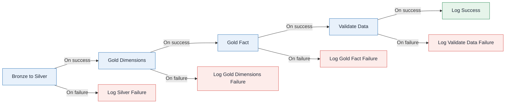

# Module 4 - Orchestration Pipeline


In this lab, you build a downstream pipeline
named `etl` that runs Bronze-to-Silver and Silver-to-Gold transformations,
validates the completed model, and logs every outcome to the Lakehouse.

The success path is:

```text
Bronze to Silver -> Gold Dimensions -> Gold Fact -> Validate Data -> Log Success
```

Each processing activity also has an error path:

```text
Failed activity -> Log Failure
```

## Final pipeline



---

## Before you start

- [ ] Complete Module 3 and confirm the Bronze tables exist in
  `lh_meridian_hr`.
- [ ] Make sure these notebooks from `module_2` are in your lab workspace:
  - `nb_02_create_silver.ipynb`
  - `nb_03_create_gold_dims.ipynb`
  - `nb_03b_create_gold_fact.ipynb`
- [ ] Make sure these notebooks are in `module_4`:
  - `nb_validate_etl.ipynb`
  - `nb_log_pipeline_run.ipynb`
- [ ] Attach `lh_meridian_hr` as the default Lakehouse for all five notebooks.
- [ ] In each new notebook, the first code cell is marked as the parameter cell.

Run each transformation notebook once interactively before building the
pipeline. This isolates notebook or Lakehouse configuration problems from
orchestration problems.

---

## 1. Build the `etl` pipeline

1. In the Fabric workspace, select **+ New item -> Data pipeline**.
2. Name the pipeline `etl`.
3. Add four Notebook activities:

| Activity | Notebook | Dependency |
| --- | --- | --- |
| `Bronze to Silver` | `nb_02_create_silver` | none |
| `Gold Dimensions` | `nb_03_create_gold_dims` | Bronze to Silver: On success |
| `Gold Fact` | `nb_03b_create_gold_fact` | Gold Dimensions: On success |
| `Validate Data` | `nb_validate_etl` | Gold Fact: On success |
4. Connect the 4 Notebooks with OnSuccess. 
5. In the `Settings` tab of the `Validate Data` Notebook, expand `Base parameters` and set the parameters to the following:

| Parameter | Value |
| --- | --- |
| `run_id` | `@pipeline().RunId` |
| `pipeline_name` | `@pipeline().Pipeline` |

The validation notebook checks required tables, nonempty outputs, unique event
IDs, matching Silver and fact counts, resolved dimension keys, and unique current
SCD2 records. It appends every result to `audit.data_quality_result` for review.
It records checks only and does not fail the pipeline.

---

## 2. Log success

1. Add a Notebook activity named `Log Success` after `Validate Data` with an
   **On success** dependency.
2. Select `nb_log_pipeline_run` and set these Base parameters:

| Parameter | Value |
| --- | --- |
| `run_id` | `@pipeline().RunId` |
| `pipeline_name` | `@pipeline().Pipeline` |
| `activity_name` | `Validate Data` |
| `status` | `Succeeded` |
| `error_code` | leave empty |
| `error_message` | leave empty |

This appends one row to `audit.pipeline_run_log`. A successful run does not send
any failure log.

---

## 3. Add error handling

Create a separate failure branch for each activity that can fail:

- `Bronze to Silver`
- `Gold Dimensions`
- `Gold Fact`
- `Validate Data`

Section 3.1 covers all four stages.

### 3.1 Log the failure

1. Add a Notebook activity named `Log Silver Failure`.
2. Connect `Bronze to Silver` to it with an **On failure** dependency.
3. Select `nb_log_pipeline_run` and set these Base parameters:

   | Parameter | Value |
   | --- | --- |
   | `run_id` | `@pipeline().RunId` |
   | `pipeline_name` | `@pipeline().Pipeline` |
   | `activity_name` | `Bronze to Silver` |
   | `status` | `Failed` |
   | `error_code` | `@activity('Bronze to Silver').error.errorCode` |
   | `error_message` | `@activity('Bronze to Silver').error.message` |

4. Add a Notebook activity named `Log Gold Dimensions Failure`.
5. Connect `Gold Dimensions` to it with an **On failure** dependency.
6. Select `nb_log_pipeline_run` and set these Base parameters:

   | Parameter | Value |
   | --- | --- |
   | `run_id` | `@pipeline().RunId` |
   | `pipeline_name` | `@pipeline().Pipeline` |
   | `activity_name` | `Gold Dimensions` |
   | `status` | `Failed` |
   | `error_code` | `@activity('Gold Dimensions').error.errorCode` |
   | `error_message` | `@activity('Gold Dimensions').error.message` |

7. Add a Notebook activity named `Log Gold Fact Failure`.
8. Connect `Gold Fact` to it with an **On failure** dependency.
9. Select `nb_log_pipeline_run` and set these Base parameters:

   | Parameter | Value |
   | --- | --- |
   | `run_id` | `@pipeline().RunId` |
   | `pipeline_name` | `@pipeline().Pipeline` |
   | `activity_name` | `Gold Fact` |
   | `status` | `Failed` |
   | `error_code` | `@activity('Gold Fact').error.errorCode` |
   | `error_message` | `@activity('Gold Fact').error.message` |

10. Add a Notebook activity named `Log Validate Data Failure`.
11. Connect `Validate Data` to it with an **On failure** dependency.
12. Select `nb_log_pipeline_run` and set these Base parameters:

    | Parameter | Value |
    | --- | --- |
    | `run_id` | `@pipeline().RunId` |
    | `pipeline_name` | `@pipeline().Pipeline` |
    | `activity_name` | `Validate Data` |
    | `status` | `Failed` |
    | `error_code` | `@activity('Validate Data').error.errorCode` |
    | `error_message` | `@activity('Validate Data').error.message` |

   `Validate Data` records data-quality results without raising an error, so this
   branch catches runtime failures such as a missing Lakehouse attachment or a
   Spark error.

## 4. Run and verify

### Successful run

1. Save and run `etl`.
2. Confirm the main path is green and no failure logging activity ran.
3. In the Lakehouse SQL analytics endpoint, run:

   ```sql
   SELECT * FROM audit.pipeline_run_log ORDER BY logged_at DESC;
   SELECT * FROM audit.data_quality_result ORDER BY checked_at DESC, check_name;
   ```

4. Confirm the current RunId has one `Succeeded` row, then review the recorded
   data-quality checks. Validation reports its findings; it does not fail the run.

### Failure run

A pipeline that has only succeeded has not tested its error handling.

1. Temporarily detach the default Lakehouse from the `nb_02_create_silver` notebook.
2. Run `etl` again.
3. Confirm that downstream activities are skipped and a `Failed` log row is
   written for `Bronze to Silver`.
4. Restore the Lakehouse attachment and run once more.

---

## Completion checklist

- [ ] The downstream pipeline is named `etl`.
- [ ] Gold dimensions finish before the Gold fact starts.
- [ ] Validation runs only after all transformations succeed.
- [ ] A successful run writes one success row.
- [ ] Every failed activity attempts a Lakehouse failure log.
- [ ] Data-quality results are stored in `audit.data_quality_result`.

---

## Reference

| Topic | Microsoft Learn |
| --- | --- |
| Notebook activity | `https://learn.microsoft.com/fabric/data-factory/notebook-activity` |
| Activity dependencies | `https://learn.microsoft.com/fabric/data-factory/activity-overview` |
| Monitor runs | `https://learn.microsoft.com/fabric/data-factory/monitor-pipeline-runs` |
