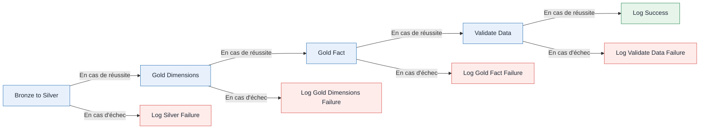

# Module 4 - Pipeline d'orchestration


Dans ce lab, vous construisez un pipeline en aval nommé `etl` qui exécute les
transformations de Bronze vers Silver et de Silver vers Gold, valide le modèle
terminé et consigne chaque résultat dans le lakehouse.

Le chemin de réussite est le suivant :

```text
Bronze to Silver -> Gold Dimensions -> Gold Fact -> Validate Data -> Log Success
```

Chaque activité de traitement possède également un chemin d'erreur :

```text
Failed activity -> Log Failure
```

## Pipeline final



---

## Avant de commencer

- [ ] Terminer le module 3 et confirmer que les tables Bronze existent dans
  `lh_meridian_hr`.
- [ ] Vérifier que les notebooks suivants du `module_2` se trouvent dans votre
  espace de travail de lab :
  - `nb_02_create_silver.ipynb`
  - `nb_03_create_gold_dims.ipynb`
  - `nb_03b_create_gold_fact.ipynb`
- [ ] Vérifier que les notebooks suivants se trouvent dans le `module_4` :
  - `nb_validate_etl.ipynb`
  - `nb_log_pipeline_run.ipynb`
- [ ] Attacher `lh_meridian_hr` comme lakehouse par défaut aux cinq notebooks.
- [ ] Dans chaque nouveau notebook, marquer la première cellule de code comme
  cellule de paramètres.

Exécutez chaque notebook de transformation une fois de manière interactive
avant de construire le pipeline. Cela permet de distinguer les problèmes de
configuration des notebooks ou du lakehouse des problèmes d'orchestration.

---

## 1. Construire le pipeline `etl`

1. Dans l'espace de travail Fabric, sélectionnez **+ Nouvel élément -> Pipeline de données**.
2. Nommez le pipeline `etl`.
3. Ajoutez 4 activités Notebook :

| Activité | Notebook | Dépendance |
| --- | --- | --- |
| `Bronze to Silver` | `nb_02_create_silver` | aucune |
| `Gold Dimensions` | `nb_03_create_gold_dims` | Bronze to Silver : En cas de réussite |
| `Gold Fact` | `nb_03b_create_gold_fact` | Gold Dimensions : En cas de réussite |
| `Validate Data` | `nb_validate_etl` | Gold Fact : En cas de réussite |

4. Reliez les quatre notebooks avec la condition **En cas de réussite**.
5. Dans l'onglet `Paramètres` de l'activité Notebook `Validate Data`, développez
   `Paramètres de base` et définissez les paramètres suivants :

| Paramètre | Valeur |
| --- | --- |
| `run_id` | `@pipeline().RunId` |
| `pipeline_name` | `@pipeline().Pipeline` |

Le notebook de validation vérifie les tables requises, les sorties non vides,
l'unicité des ID d'événement, la correspondance entre le nombre de lignes Silver
et celui de la table de faits, la résolution des clés de dimension et l'unicité
des enregistrements SCD2 courants. Il ajoute chaque résultat à
`audit.data_quality_result` pour examen. Il enregistre uniquement les contrôles
et ne provoque pas l'échec du pipeline.

---

## 2. Consigner la réussite

1. Ajoutez une activité Notebook nommée `Log Success` après `Validate Data` avec
   une dépendance **En cas de réussite**.
2. Sélectionnez `nb_log_pipeline_run` et définissez les paramètres de base
   suivants :

| Paramètre | Valeur |
| --- | --- |
| `run_id` | `@pipeline().RunId` |
| `pipeline_name` | `@pipeline().Pipeline` |
| `activity_name` | `Validate Data` |
| `status` | `Succeeded` |
| `error_code` | laisser vide |
| `error_message` | laisser vide |

Cette activité ajoute une ligne à `audit.pipeline_run_log`. Une exécution réussie
n'envoie aucun journal d'échec.

---

## 3. Ajouter la gestion des erreurs

Créez une branche d'échec distincte pour chaque activité susceptible d'échouer :

- `Bronze to Silver`
- `Gold Dimensions`
- `Gold Fact`
- `Validate Data`

La section 3.1 couvre les quatre étapes.

### 3.1 Consigner l'échec

1. Ajoutez une activité Notebook nommée `Log Silver Failure`.
2. Reliez `Bronze to Silver` à cette activité avec une dépendance **En cas d'échec**.
3. Sélectionnez `nb_log_pipeline_run` et définissez les paramètres de base suivants :

   | Paramètre | Valeur |
   | --- | --- |
   | `run_id` | `@pipeline().RunId` |
   | `pipeline_name` | `@pipeline().Pipeline` |
   | `activity_name` | `Bronze to Silver` |
   | `status` | `Failed` |
   | `error_code` | `@activity('Bronze to Silver').error.errorCode` |
   | `error_message` | `@activity('Bronze to Silver').error.message` |

4. Ajoutez une activité Notebook nommée `Log Gold Dimensions Failure`.
5. Reliez `Gold Dimensions` à cette activité avec une dépendance **En cas d'échec**.
6. Sélectionnez `nb_log_pipeline_run` et définissez les paramètres de base suivants :

   | Paramètre | Valeur |
   | --- | --- |
   | `run_id` | `@pipeline().RunId` |
   | `pipeline_name` | `@pipeline().Pipeline` |
   | `activity_name` | `Gold Dimensions` |
   | `status` | `Failed` |
   | `error_code` | `@activity('Gold Dimensions').error.errorCode` |
   | `error_message` | `@activity('Gold Dimensions').error.message` |

7. Ajoutez une activité Notebook nommée `Log Gold Fact Failure`.
8. Reliez `Gold Fact` à cette activité avec une dépendance **En cas d'échec**.
9. Sélectionnez `nb_log_pipeline_run` et définissez les paramètres de base suivants :

   | Paramètre | Valeur |
   | --- | --- |
   | `run_id` | `@pipeline().RunId` |
   | `pipeline_name` | `@pipeline().Pipeline` |
   | `activity_name` | `Gold Fact` |
   | `status` | `Failed` |
   | `error_code` | `@activity('Gold Fact').error.errorCode` |
   | `error_message` | `@activity('Gold Fact').error.message` |

10. Ajoutez une activité Notebook nommée `Log Validate Data Failure`.
11. Reliez `Validate Data` à cette activité avec une dépendance **En cas d'échec**.
12. Sélectionnez `nb_log_pipeline_run` et définissez les paramètres de base suivants :

    | Paramètre | Valeur |
    | --- | --- |
    | `run_id` | `@pipeline().RunId` |
    | `pipeline_name` | `@pipeline().Pipeline` |
    | `activity_name` | `Validate Data` |
    | `status` | `Failed` |
    | `error_code` | `@activity('Validate Data').error.errorCode` |
    | `error_message` | `@activity('Validate Data').error.message` |

   `Validate Data` enregistre les résultats de qualité des données sans générer
   d'erreur. Cette branche intercepte donc les erreurs d'exécution, comme un
   lakehouse non attaché ou une erreur Spark.

## 4. Exécuter et vérifier

### Exécution réussie

1. Enregistrez et exécutez `etl`.
2. Confirmez que le chemin principal est vert et qu'aucune activité de
   journalisation des échecs ne s'est exécutée.
3. Dans le point de terminaison d'analytique SQL du lakehouse, exécutez :

   ```sql
   SELECT * FROM audit.pipeline_run_log ORDER BY logged_at DESC;
   SELECT * FROM audit.data_quality_result ORDER BY checked_at DESC, check_name;
   ```

4. Confirmez que le RunId courant comporte une ligne `Succeeded`, puis examinez
   les contrôles de qualité des données enregistrés. La validation présente ses
   résultats, mais ne provoque pas l'échec de l'exécution.

### Exécution en échec

Un pipeline qui a uniquement réussi n'a pas encore permis de tester sa gestion
des erreurs.

1. Détachez temporairement le lakehouse par défaut du notebook
   `nb_02_create_silver`.
2. Exécutez de nouveau `etl`.
3. Confirmez que les activités en aval sont ignorées et qu'une ligne de journal
   `Failed` est écrite pour `Bronze to Silver`.
4. Rattachez le lakehouse et effectuez une nouvelle exécution.

---

## Checklist de fin

- [ ] Le pipeline en aval est nommé `etl`.
- [ ] Les dimensions Gold sont terminées avant le démarrage de la table de faits Gold.
- [ ] La validation s'exécute uniquement après la réussite de toutes les transformations.
- [ ] Une exécution réussie écrit une ligne de réussite.
- [ ] Chaque activité en échec tente d'écrire un journal d'échec dans le lakehouse.
- [ ] Les résultats de qualité des données sont stockés dans `audit.data_quality_result`.

---

## Références

| Sujet | Microsoft Learn |
| --- | --- |
| Activité Notebook | `https://learn.microsoft.com/fabric/data-factory/notebook-activity` |
| Dépendances des activités | `https://learn.microsoft.com/fabric/data-factory/activity-overview` |
| Superviser les exécutions | `https://learn.microsoft.com/fabric/data-factory/monitor-pipeline-runs` |